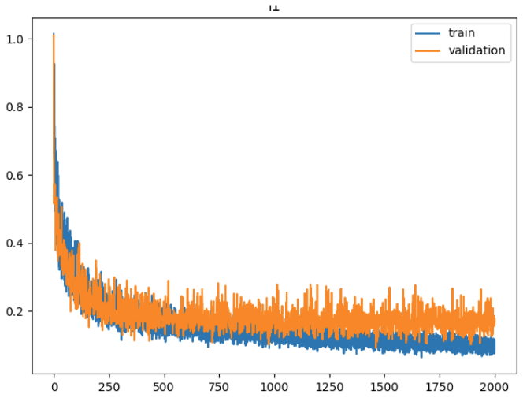

# Setup

## Arm control
In the first termial:
```bash
cd Documents/cobot_magic/remote_control_joint_ctrl
./tools/can.sh # all five terminals fine, close them
```
If you plan to collect data or just teleoperate:
```bash
./tools/remote.sh
```
Then, you should press "i" at `master1` and `master2` terminals to enable teleoperation. 

Or if you plan to replay collected data or do model inference:
```bash
./tools/puppet.sh
```

## Camera
In the second terminal:
```bash
roslaunch astra_camera multi_camera.launch
```

# Collect data
Open a new terminal:
```bash
conda activate aloha
cd Documents/cobot_magic/collect_data
python collect_data.py --compress_image --task_name <TASK_NAME> --max_timesteps <MAX_TIMESTEPS> --episode_idx <EPISODE_IDX>
```
Argument explanation:
* `--compress_image` enables the compression of collected images.
* <TASK_NAME> should be specific to each task.
* <MAX_TIMESTEPS> is the running steps during data collection. It depends on the length of task horizon. Typically, 30 time steps correspond 1 sec in wall-clock time.
* <EPISODE_IDX> is the index of each collected demo. It starts from 0 and goes like 1, 2, 3, ...

Other notes:
* Use puppet arm states as obs. Observation topic: `/puppet/joint_left` and `/puppet/joint_right`
* Use master arm states as actions. Action topic: `/master/joint_left` and `/master/joint_right`
* The collected data is typically stored in the shape of (num_steps, num_dims)

# Visualize data
```bash
conda activate aloha
cd Documents/cobot_magic/collect_data
python visualize_episodes.py --task_name <TASK_NAME> --episode_idx <EPISODE_IDX>
```
Argument explanation:
* <TASK_NAME> should be the same as that specified during data collection.
* <EPISODE_IDX> is the index of the demo you want to visualize.
* The script outputs the joint angle plot as `.png` file and camera image as `.mp4` file. They will be stored in the folder `./data/<TASK_NAME>/visualization`.

# Replay data
```bash
conda activate aloha
cd Documents/cobot_magic/collect_data
python replay_data.py --task_name <TASK_NAME> --episode_idx <EPISODE_IDX>
```
Make puppet arms reproduce recorded demo by replaying master arm states. Other data, including image and puppet arm states, can be also replayed.


# Training
```bash
conda activate aloha
cd Documents/cobot_magic/aloha-devel
python act/train.py --task_name <TASK_NAME> --num_epochs <NUM_EPOCHS> --num_episodes <NUM_EPISODES> --lr <LEARNING_RATE> --batch_size <BATCH_SIZE> --chunk_size <CHUNK_SIZE> --kl_weight <KL_WEIGHT>  --save_periodic_ckpt
```
Argument explanation:
* <TASK_NAME> should be the same as that specified during data collection.
* <NUM_EPOCHS> is normally between 5000 and 8000, but it depends.
* <NUM_EPISODES> specify how much data is used for training.
* <LEARNING_RATE> and <BATCH_SIZE> are coupled. Normally set as 1e-5 and 8 if training in our aloha server.
* <CHUNK_SIZE> is normally set as 48 in our case.
* <KL_WEIGHT> is normally set as 10 or 100. 
* `--save_periodic_ckpt` enables saving checkpoints every 100 epochs. By default, we disable it considering limited memory.
* See [ACT tuning tips](#act-tuning-tips) for more details.

For example:
```bash
python act/train.py --task_name pick_bolt --num_epochs 8000 --num_episodes 50 --lr 1e-5 --batch_size 8 --chunk_size 48 --kl_weight 10
```

The model will be stored in the folder `./model/<TASK_NAME>_<TIME_STAMP>/`. By default, only the best policy will be saved, i.e., `policy_best_epoch_4728_seed_0.ckpt`, where `epoch_4728` indicates which epoch generates the best policy.

The important training parameters are summarized in `<TASK_NAME>.json` file and `<TASK_NAME>.xlsx` table.

# Inference
```bash
conda activate aloha
cd Documents/cobot_magic/aloha-devel
python act/inference.py --temporal_agg --task_name <TASK_NAME>_<TIME_STAMP> --chunk_size <CHUNK_SIZE> --kl_weight <KL_WEIGHT>
```
Argument explanation:
* `--temporal_agg` enables temporal ensembling, resulting in smoother transitions in joint angle changes.
* <TASK_NAME> should be the same as that specified during data collection.
* <CHUNK_SIZE> and <KL_WEIGHT> should be the same as that set in training phase.

For example:
```bash
python act/inference.py --temporal_agg --task_name slide_ziploc_2024_07_09_05_02_26 --chunk_size 48 --kl_weight 10
```

# Simulation
In the first terminal:
```
roscore
```
In the second terminal:
```
conda activate aloha
python ~/Documents/aloha_sim_ws/src/mobile_aloha_sim/aloha_mujoco/aloha/scripts/aloha_ctrl.py
```
In the third terminal:
```
python act/inference.py --task_name transfer_cube --temporal_agg
```
In the fourth terminal:
```
python replay_data.py --simulation --frame_rate 30 --task_name transfer_cube --episode_idx 60
```

# [ACT Tuning Tips](https://docs.google.com/document/d/1FVIZfoALXg_ZkYKaYVh-qOlaXveq5CtvJHXkY25eYhs/edit?usp=sharing)
General tips:
- Chunk size is the most important param to tune when applying ACT to a new environment. One chunk should correspond to ~1 secs wall-clock robot motion. In our case, the default value of chunk size is 32, which meets this requirement.
- High KL weight (10 or 100), or train **without** CVAE encoder.
- Consider removing temporal_agg and increase query frequency [here](https://github.com/tonyzhaozh/act/blob/main/imitate_episodes.py#L193) to be the same as your chunk size. I.e. each chunk is executed fully.
- train for **very long** (well after things plateaus, see picture)
- Try to increase batch size as much as possible, and increase lr accordingly. E.g. batch size 64 with learning rate 5e-5 versus batch size 8 and learning rate 1e-5
- Have separate backbones for each camera (requires changing the code, see [this commit](https://github.com/tonyzhaozh/act/commit/20fc6e990698534b89a41c2c85f54b7ff4b0c280))
- L1 loss > L2 loss (not precise enough)
- Abs position control > delta/velocity control (harder to recover)
- Try multiple checkpoints

For real-world experiments:
- Train for even longer (5k - 8k steps, especially if multi-camera)
- If inference is too slow -> robot moving slowly: disable temporal_agg and increase query frequency [here](https://github.com/tonyzhaozh/act/blob/main/imitate_episodes.py#L193). We tried as high as 20.

Example loss curve (L1):

